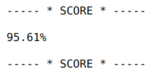
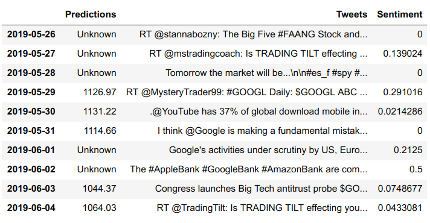

# Stock Prediction

## IronHack Data Bootcamp

### Final Project

#### Introduction:

As a final project I decided to try to predict the daily stock price of different companies by training a machine learning algorithm.  I decided to do this project since I thought that it provided good oportunities to practice many of the topics learned through the bootcamp.  The main porpuse of the project was to apply the knowledge gained into a practical project, and test my data analytics abilities without a guide.

#### Objectives:

-  Train a stock prediction model with **sklearn**
-  Add historic **Tweeter** sentiment analysis to the model
-  Do a **Markov Chain Montecarlo Simulation** (MCMC) of the stock price evolution

##### Pipeline

-  **API Requests:**  QUANDL provides out dated historical data of stock prices in their free version.  This was helpfull to test the model.  YahooFinancials is a private ibrary that web-scrapps from Yahho Financial and provides real time data and historic prices, so the second choice was used for most of the project.

-  **Feature Engineering:**  The API provides open, close, high, low & volume for each stock.  This features are highly correlated so from the information provided new features were calculated.

Change = Close - Open

Volatility = High - Low

-  **Linear Regression:**  Many machine learning regression models were trained and tested, but a t the end a simple linear regression proved to be the most concistent and accurate model.

- **Twitter Sentiment Analysis:**  The next step was to use Twitter's API to get hitoric tweets related to each company, but later I discovered that Twitter only gives about 10 days of historic data through their API for free.  Since I needed years of data to be able to train a model using sentiment analysis this step was modified.  I used those 10 days to do Sentiment Analysis using TextBlob and added that information to the last days of stock prices to have a refernece of the publics opinion in the days prior to the prediction.

- **Markov Chain Monte Carlo:**  MCMC is widley used technique using probability to predict the evolution of different variables.  This method was applied to each of the companies stock by analyzing the change probabilistic behaviour and then randomly apply those changes through thousands of days.

#### Results:

##### Correlation Matrix on Google's historic stock data

##### Linear Regression Score on Boeing Company's Stock

##### Apple's stock price evolution

##### Boeing's stock predictions

##### Sentiment Anlaysis

##### Markov Chain Monte Carlo

#### Conclusions:

-  Stock prediction is inconsistent.  The results aren't accurate enoghf to be usefull.

-  Great practice of aquired skills in data manipulation, data mining, graphing and machine learning.

-  MCMC provides real insight on the future and ther risk of investing.  This is the part of the project that provides usable results.

-  Feature Engineering skyrockets the model’s accuracy, spacialy in simple models such as Linear Regression.